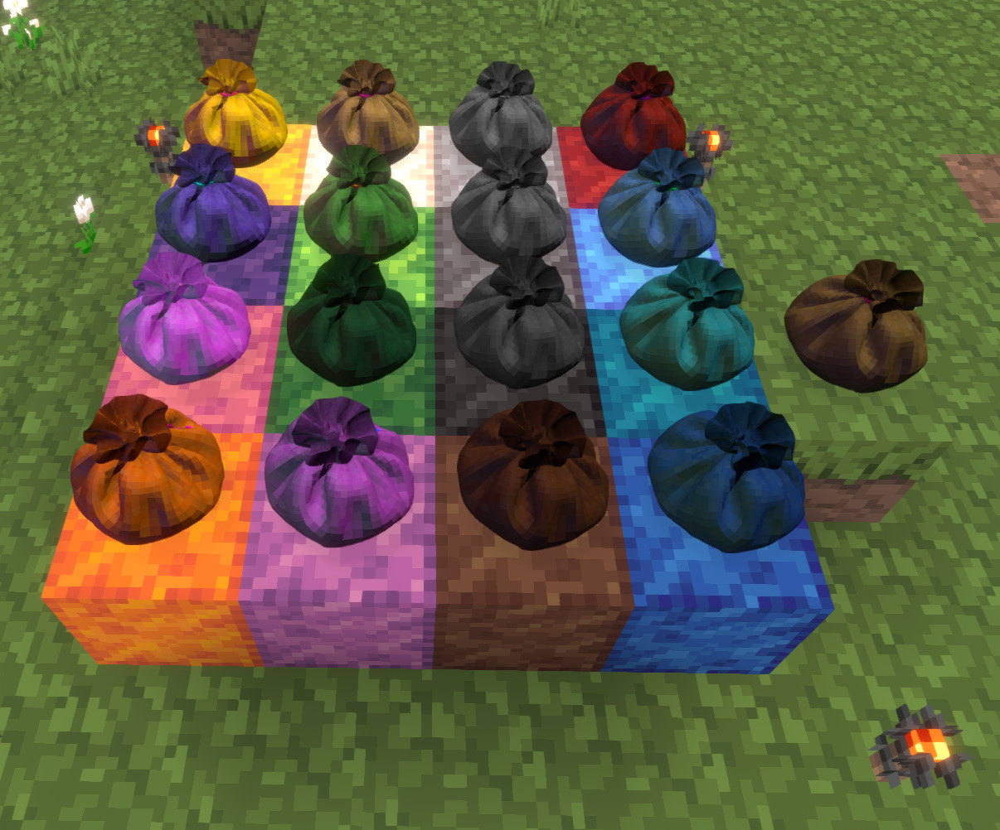

# Prestibags Luanti Mod

[](https://content.luanti.org/packages/Codiac/prestibags/)

Prestibags are simple bags that act like chests you can pick up. They do not
modify the player's normal inventory formspec, so they will interfere with any
mods that do. Here are some of their features:

* Retain their inventory when picked up or unloaded/reloaded by the server.
* Can be stored in other bags, nested as deeply as you like.
* Are NOT owned, so any player can open them and pick them up.
* Are flammable, so don't put them near lava or fire!
* Fit in spaces with non-solid nodes (e.g. water, torches), but don't build
  solid stuff on top of them!

Note that bags are "active entities", although they are non-physical and act in
many ways like nodes. This means that the "/clearobjects" command will destroy
them, and they can potentially take damage from sources other than fire. They
will show wear like a tool when taken into inventory if they have taken any
damage.

[Luanti Forum](https://forum.luanti.org/viewtopic.php?t=31850)

This mod is a fork of the original mod by prestidigitator
<https://forum.luanti.org/viewtopic.php?t=5026>.



## Required Luanti Version

* 5.10.0

## Dependencies

### Required

* None

### Optional

* default, wool, fire, mcl_wool

## Craft Recipes

(W = "group:wool"):

```text
— W —
W — W
W W W
```

## Git Repositories

* <https://codeberg.org/Codiac/prestibags>
* <https://github.com/prestidigitator/minetest-mod-prestibags>

## Change History

* v2.0.1
	* Improve Copyright attribution.

* v2.0.0
	* Added `mod.conf` with mod information
	* Updated to latest Luanti standards
	* Tidied code
	* Fixed bags disappearing
	* Support inventories with different rows and columns
	* Added borders to inventory slots
	* Added colored bags
	* Added Mineclonia support
	* Added translation support
	* Changed license

* Version 1.0
	* Released 2013-03-07.
	* First working version.

## Copyright and Licensing

All content, including source code, textures, models, and sounds, are 100%
original content by the mod authors (prestidigitator and Codiac).

## Authors

* prestidigitator (as registered on forum.luanti.org)
* Codiac (as registered on forum.luanti.org)

## Coloring Images

The colors are applied in game using [hsl
colorization](https://api.luanti.org/textures/#hslhuesaturationlightness).

## Legal

The original mod by prestidigitator was licensed WTFPL. This was changed for version 2.0.0.

See [LICENSE.md](LICENSE.md) for more details.

### Source Code License

The source code in this mod is licensed under the terms of the GNU General
Public License as published by the Free Software Foundation, either version 3 of
the License, or (at your option) any later version.

### Media License

The images and image sources in this mod are licensed under the terms of the
Creative Commons Attribution-ShareAlike 4.0 (CC BY-SA 4.0).

